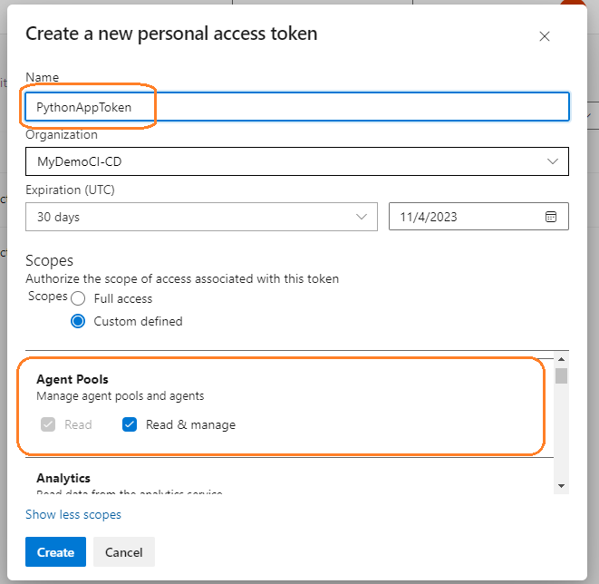

# Triển khai CI/CD để Build và Deploy một ứng dụng web Python sử dụng Azure DevOps

## Lab scenario
Trong bài lab này chúng ta sẽ thực hiện deploy một ứng dụng web python-flask lên Azure app service được tích hợp CI/CD bằng cách sử dụng Azure Pipelines.

### Instructions

## Task 1: Khởi tạo repository và cài đặt các thưc viện cần thiết

1. Thực hiện clone repository sau về máy để thực hiện bài lab: [Link github](https://github.com/huyhuy8122001/AzureDevops-Piplines)

2. Tạo và active virtual environment dưới máy local để test ứng dụng có hoạt động hay không, mở terminal và chạy các câu lệnh sau (lệnh được thực hiện trên máy Windows):
```sh
cd AzureDevops-Piplines
```
```sh
python -m venv venv
```
```sh
.\venv\Scripts\activate.bat
```
```sh
pip install -r requirements.txt
```
```sh
python -m flask run
```

3. Mở trình duyệt và điều hướng đến http://127.0.0.1:5000 để xem ứng dụng. Sau khi thấy trang web đã hoạt động, ấn **Ctrl+C** để dừng server flask.

    

## Task 2: Cấu hình Azure App Service
Azure App Service cho phép build và host các ứng dụng web bằng nhiều ngôn ngữ lập trình khác nhau mà không cần lo lắng về cơ sở hạ tầng.

Trong task này chúng ta sẽ thực hiện tạo ra 2 resource trên Azure: một resource group và một web app. 

### Resource group

1. Mở trình duyệt và điều hướng đến: https://portal.azure.com

1. Tại Azure Portal, tìm và chọn vào **Resource group**, sau đó chọn **+ Create**

    

1. Ở tab **Basics**, điền vào những thông tin như sau:

    | Setting | Value |
    | --- | --- |
    | Subscription | **Chọn vào subscription của bạn** |
    | Resource group | **rg-pythonwebapp-xxx** |
    | Location | **(Asia Pacific) Southeast Asia** |

1. Chọn **Review + create**.

    

1. Sau khi hệ thống báo **Validation passed** thì nhấn chọn **Create**. Sẽ mất 1-2 phút để Azure deploy Resource group.

### Azure Web App

1. Tại Azure Portal, tìm và chọn vào **App Services**, sau đó chọn **+ Create** > **+ Web App**.

    

1. Ở tab **Basics**, điền vào những thông tin như sau (để defaults những thông tin không được cung cấp):

    | Setting | Value |
    | --- | --- |
    | Subscription | **Chọn vào subscription của bạn** |
    | Resource group | **rg-pythonwebapp-xxx** |
    | Name | **pythonwebapp-xxx** |
    | Publish | **Code** |
    | Runtime stack | **Python 3.8** |
    | Region | **(Asia Pacific) Southeast Asia** |
    | Pricing plan | Explore pricing plans > **Free F1 (Shared infrastructure)** |
    

1. Để mặc định các tab còn lại và sau đó nhấn **Review + create**

1. Sau khi hệ thống báo **Validation passed** thì nhấn chọn **Create**. Sẽ mất tầm 1-2p để Azure deploy cho chúng ta.

Tên của ứng dụng sẽ được sử dụng như một phần của URL, thường sẽ là **https:// < your-web-app-name >.azurewebsites.net**. Điều hướng đến url đó sẽ thấy được một trang Web App mặc định.


## Task 3: Khởi tạo Azure DevOps Project và thiết lập Azure Repos

### Khởi tạo Azure DevOps Project
1. Đăng nhập vào [Azure Devops](https://azure.microsoft.com/en-us/products/devops/)

1. Khởi tạo project

    | Setting | Value |
    | --- | --- |
    | Project name | **PythonWebApp** |
    | Visibility | **Private** |

    

### Setup Azure Repos

1. Thay địa chỉ url của remote repository

```sh
git remote set-url origin <Azure Devops Repos url>
```

2. Kiểm tra lại bằng lệnh:

```sh
git remote -v 
```


3. Push code lên Azure DevOps Repos:

```sh
git push -u origin main
```


## Task 4: Kết nối Azure DevOps Pipelines đến App service instance

1. Để kết nối pipeline đến App service instance, chọn vào **Create Pipeline**.

    
    
1. Tại tab **Connect**, chọn Azure Repos Git.

    

1. Tại tab **Select**, chọn vào repo **PythonWebApp**.

    

1. Tại tab **Config**, chọn **Python to Linux Web App on Azure** để làm cấu hình cho pipeline.

    

1. Cửa sổ pop-up hiện ra yêu cầu bạn chọn Azure subscription của mình.

    

1. Tiếp theo chọn vào Web App đã tạo ở task 1, sau đó chọn “Validate and configure”.

    


## Task 5: Thiết lập self host agent cho Azure Pipelines

1. Di chuyển đến Azure DevOps dashboard

1. Chọn vào Project setting

1. Chọn Agent pools

1. Nhập vào tên **Ubuntu20-VM-Pool**, check vào ô **Grant access permission to all pipelines**

1. chọn vào **Ubuntu20-VM-Pool** vừa tạo, chọn Agent, New agent

1. Lựa chọn đúng hệ điều hành của máy agent để thực hiện thiết lập, ở đây chúng ta sử dụng máy chủ Linux

1. Thực hiện kết nối đến máy chủ Ubuntu để build agent

1. Tạo thư mục

    ```sh
    mkdir myagent && cd myagent
    ```

1. Cài đặt agent
    ```sh
    wget https://vstsagentpackage.azureedge.net/agent/3.227.1/vsts-agent-linux-x64-3.227.1.tar.gz
    ```
1. Cấu hình agent
    ```sh
    tar zxvf ~/Downloads/vsts-agent-linux-x64-3.227.1.tar.gz
    ```

    ```sh
    ./config.sh
    ```
    Tiếp theo nhập, Nhập **Y**
    ```sh
    Accept the Team Explorer Everywhere license agreement now? > y
    ```
1.
    ```sh
    Enter server URL >
    https://dev.azure.com/yourorganization
    ```
1.
    ```sh
    Enter authentication type (press enter for PAT) > PAT
    ```
1. Khởi tạo personal access token (PAT)

    Click vào mục User settings, chọn **Personal access tokens** > Chọn **New Token**

    

1. Nhập tên, chọn custom defined. Tại mục scope chọn Agent Pools (read, manage).

        

1. Chọn **Create** và copy token vào terminal ubuntu.

1. 
    ```sh
    Enter Agent pool > Ubuntu20-VM-Pool 
    ```
1. 
    ```sh
    Enter Agent name > Ubuntu20-VM-Pool 
    ```
1. 
    ```sh
    Enter work folder > enter 
    ```
1. Cấu hình để Agent run as a Servie
    ```sh
    sudo ./svc.sh install &
    ```
    ```sh
    ./runsvc.sh &
    ```

